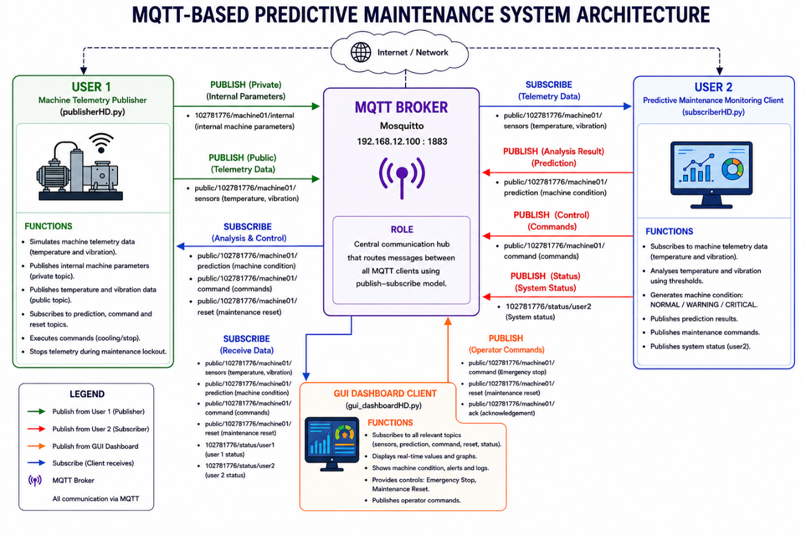
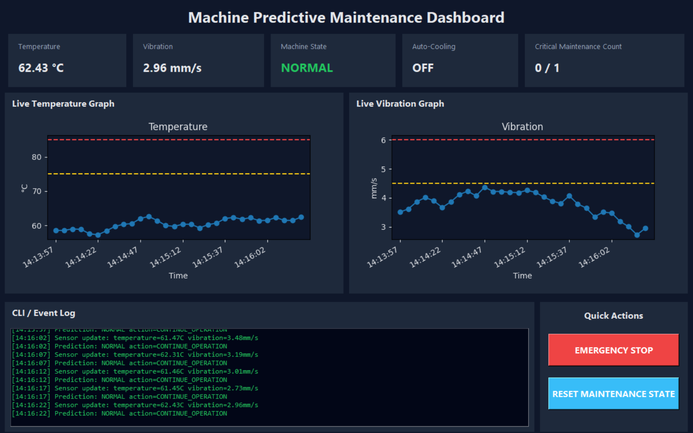

# 🏭 IoT Predictive Maintenance Dashboard

An Industrial Internet of Things (IIoT) application that simulates a predictive maintenance system using the **MQTT Publish–Subscribe** communication model. The project continuously monitors machine telemetry, analyses equipment health based on predefined operating thresholds, and visualises real-time sensor data through an interactive dashboard.

This project demonstrates IoT communication, real-time data processing, predictive maintenance logic, and industrial dashboard development using Python.

---
# ✨ Features
- 📡 MQTT Publish–Subscribe communication
- 🌡️ Simulated temperature monitoring
- 📈 Simulated vibration monitoring
- 🧠 Rule-based predictive maintenance analysis
- 🚨 Automatic machine health classification
- ❄️ Automatic cooling recommendation
- ⛔ Emergency machine stop command
- 🔄 Maintenance reset functionality
- 📊 Real-time telemetry dashboard
- 📉 Live temperature graph
- 📉 Live vibration graph
- 📝 MQTT event logging
- 💬 JSON message exchange
- 🖥️ Modern Tkinter dashboard interface

---
# 🛠 Technologies Used
Python: Core programming language 
MQTT: Publish–Subscribe communication 
Eclipse Mosquitto: MQTT Broker 
Paho MQTT: MQTT client library 
Tkinter: Dashboard GUI 
Matplotlib: Live data visualisation 
JSON: Message formatting 
VS Code: Development environment 

---
# 📡 System Architecture
<p align="center">
  
</p>

<p align="center">
  <em>MQTT-based Dashboard System Architecture</em>
</p>

---
# 🔄 MQTT Communication Flow
public/.../sensors | Publisher | Dashboard & Prediction Engine | Machine telemetry 

public/.../prediction | Prediction Engine | Publisher & Dashboard | Machine condition 

public/.../command | Prediction Engine | Publisher | Machine commands 

public/.../reset | Dashboard | Publisher | Maintenance reset 

status/user1 | Publisher | Dashboard | Publisher status 

status/user2 | Prediction Engine | Dashboard | Subscriber status

---

# 🧠 Predictive Maintenance Logic

The prediction engine continuously evaluates incoming sensor readings using predefined operating thresholds.

| 🟢 Normal | < 75°C | < 4.5 mm/s | Continue operation 

| 🟡 Warning | ≥ 75°C | ≥ 4.5 mm/s | Enable cooling & schedule maintenance 

| 🔴 Critical | ≥ 85°C | ≥ 6.0 mm/s | Emergency stop & inspection 

---

# 📸 Screenshots
<p align="center">
  
</p>

<p align="center">
  <em>MQTT-based Dashboard Overview</em>
</p>

For more detailed scenario, do refer to [user-manual.pdf](user-manual.pdf)

# 🚀 Quick Start

## Install Python

Download Python 3.11 or newer:

https://www.python.org/downloads/

Verify installation:

```bash
python --version
```

---

## Clone the repository

```bash
git clone https://github.com/YOUR_USERNAME/iot-predictive-maintenance-dashboard.git

cd iot-predictive-maintenance-dashboard
```

---

## Install Python dependencies

Install the required libraries:

```bash
pip install paho-mqtt matplotlib
```

Tkinter is included with most standard Python installations.

Alternatively:

```bash
pip install -r requirements.txt
```

where `requirements.txt` contains:

```text
paho-mqtt
matplotlib
```

---

## Start the Predictive Maintenance Engine

```bash
python subscriberHD.py
```

---

## Launch the Dashboard

```bash
python gui.py
```

---

## Start the Machine Telemetry Publisher
```bash
python publisherHD.py
```

Go look at the dashboard (gui.py) will begin displaying live sensor readings, predictions, graphs, and machine status updates.
---

# 💻 Dashboard Features
The graphical dashboard provides:
- Live temperature monitoring
- Live vibration monitoring
- Machine operating state
- Cooling system status
- Maintenance counter
- Emergency stop notification
- MQTT communication log
- Live sensor graphs
- Maintenance reset button

---

# 🚧 Challenges
Some of the key challenges encountered included:
- Designing a reliable publish–subscribe communication workflow.
- Synchronising multiple MQTT clients.
- Updating live graphs efficiently.
- Designing an intuitive dashboard for monitoring machine health.
- Managing command and acknowledgement messages between publisher and subscriber.
---

# 🔮 Future Improvements

Potential future enhancements include:
- 🤖 Machine learning-based failure prediction
- ☁️ Cloud MQTT broker integration
- 📱 Mobile dashboard
- 📊 Historical data storage
- 🗄️ Database integration
- 📧 Email/SMS maintenance alerts
- 📈 Predictive trend forecasting
- 🌐 Web-based dashboard
- 🔐 User authentication
- 📡 Support for multiple machines

---

# 📜 License
This project was developed as part of my personal software engineering portfolio to explore Industrial IoT, MQTT communication, predictive maintenance, and real-time dashboard development using Python.
